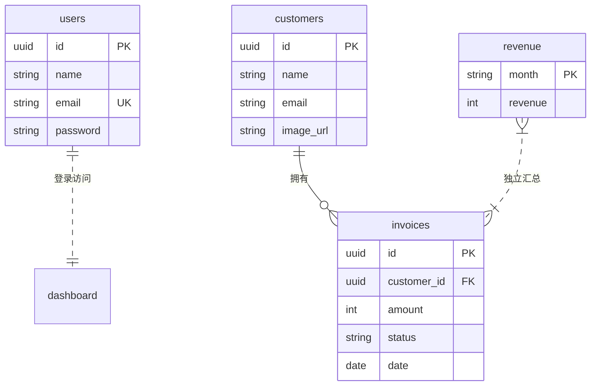

# 数据库表关系说明

本文档描述 `app/seed/route.ts` 中创建的四张表及其关系，对应示例数据见 `app/lib/placeholder-data.ts`。

## ER 关系图



## 四张表概览

这是一个 **Dashboard 后台管理系统** 的数据模型，围绕「登录用户 → 客户 → 发票 → 收入统计」展开。

| 表名 | 用途 |
|------|------|
| `users` | 后台管理员登录账号 |
| `customers` | 客户信息 |
| `invoices` | 发票记录（核心业务表） |
| `revenue` | 月度收入汇总（图表展示） |

---

## 1. `users` — 系统登录用户

| 字段 | 类型 | 说明 |
|------|------|------|
| `id` | UUID | 主键，默认 `uuid_generate_v4()` |
| `name` | VARCHAR(255) | 用户名 |
| `email` | TEXT | 邮箱，唯一约束 |
| `password` | TEXT | bcrypt 加密后的密码 |

**与其他表的关系：无直接外键关联。**

这是后台管理员账号，用于登录 Dashboard，不参与客户/发票业务逻辑。示例数据中只有 1 个用户（`user@nextmail.com`）。

---

## 2. `customers` — 客户

| 字段 | 类型 | 说明 |
|------|------|------|
| `id` | UUID | 主键 |
| `name` | VARCHAR(255) | 客户姓名 |
| `email` | VARCHAR(255) | 客户邮箱 |
| `image_url` | VARCHAR(255) | 头像路径 |

**关系：一对多 → `invoices`**

一个客户可以拥有多张发票。示例数据中有 6 位客户（Evil Rabbit、Delba de Oliveira、Lee Robinson 等）。

---

## 3. `invoices` — 发票

| 字段 | 类型 | 说明 |
|------|------|------|
| `id` | UUID | 主键 |
| `customer_id` | UUID | 关联 `customers.id` |
| `amount` | INT | 金额（整数，如 15795） |
| `status` | VARCHAR(255) | `'pending'`（待付）或 `'paid'`（已付） |
| `date` | DATE | 开票日期 |

**关系：多对一 ← `customers`**

每张发票属于一个客户，通过 `customer_id` 字段关联。示例数据中有 13 张发票，例如 Evil Rabbit 拥有 2 张发票。

应用层通过 `JOIN` 查询客户信息：

```sql
SELECT invoices.amount, customers.name, customers.image_url, customers.email, invoices.id
FROM invoices
JOIN customers ON invoices.customer_id = customers.id
ORDER BY invoices.date DESC
LIMIT 5;
```

---

## 4. `revenue` — 月度收入

| 字段 | 类型 | 说明 |
|------|------|------|
| `month` | VARCHAR(4) | 月份缩写（Jan–Dec），唯一 |
| `revenue` | INT | 该月总收入 |

**与其他表的关系：逻辑独立，无外键。**

这是预聚合的月度收入数据，供 Dashboard 首页柱状图使用，**不是**从 `invoices` 表实时计算得出。示例数据包含 12 个月的固定数值。

---

## 关系总结

| 关系 | 类型 | 说明 |
|------|------|------|
| `customers` → `invoices` | **1 : N** | 一个客户可有多张发票，通过 `customer_id` 关联 |
| `users` ↔ 其他表 | **无关联** | 仅用于身份认证 |
| `revenue` ↔ 其他表 | **无关联** | 独立展示数据，与发票表无约束 |

---

## 业务数据流

```
users      → 登录 Dashboard
customers  → 客户列表 / 客户详情页
invoices   → 发票 CRUD、待付/已付金额统计
revenue    → 首页收入柱状图
```

Dashboard 卡片上的「客户数、发票数、待付/已付总额」等统计，主要来自 `customers` 和 `invoices` 的聚合查询，而非 `revenue` 表。

---

## 注意事项

### 1. 未定义外键约束

`invoices.customer_id` 在逻辑上是外键，但建表语句中**没有**声明：

```sql
FOREIGN KEY (customer_id) REFERENCES customers(id)
```

因此数据库不会强制「客户必须先存在」，数据完整性由应用层和 seed 顺序保证。

### 2. Seed 插入顺序有依赖

`app/seed/route.ts` 中的执行顺序：

1. `seedUsers()` — 独立
2. `seedCustomers()` — 必须先于 invoices
3. `seedInvoices()` — 依赖 customers 已存在
4. `seedRevenue()` — 独立

必须先插入 `customers`，再插入 `invoices`，否则 `customer_id` 会指向不存在的记录。

### 3. 连接池配置

使用 Supabase 等连接池（PgBouncer transaction 模式）时，`postgres.js` 需设置 `prepare: false`，否则会出现 prepared statement 相关错误（PostgreSQL 错误码 26000）。
